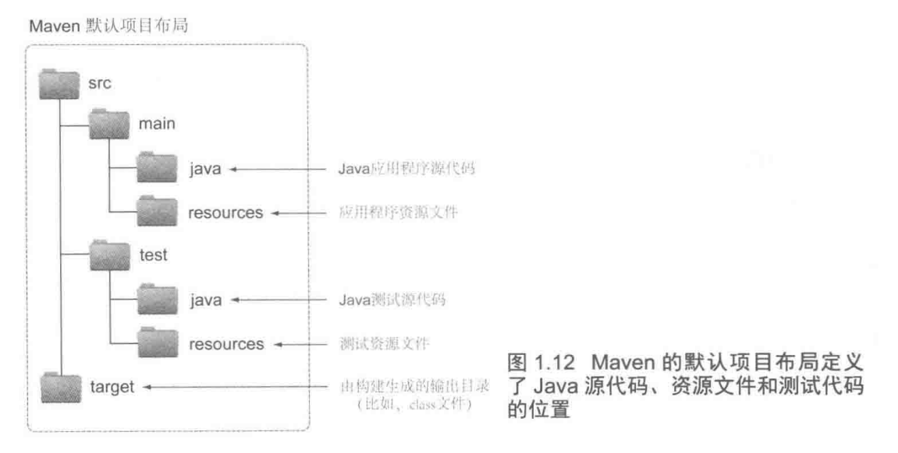
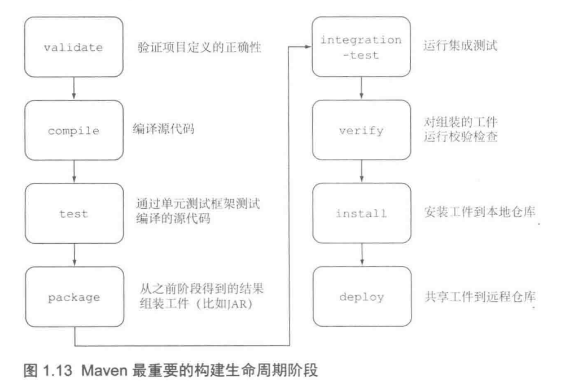
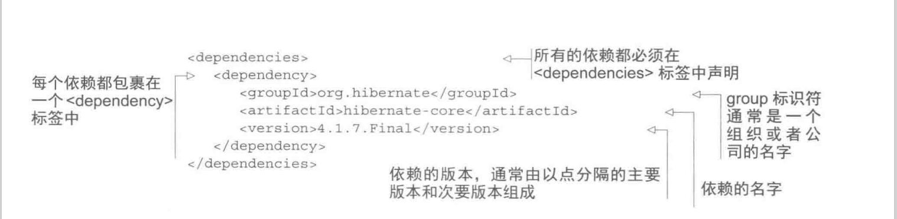
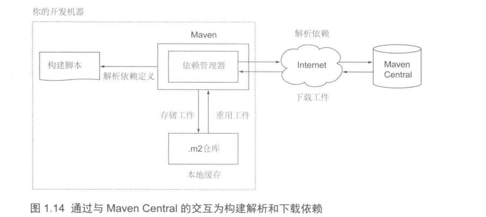
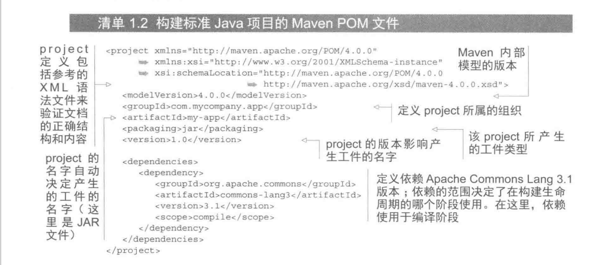

# 1.构建工具

###构建文件，构建引擎，依赖管理器

1.构建文件，可以定义构建的一系列任务包含编译代码，打包等，定义外部依赖，配置信息以及各个任务之间的关系，也称作构建脚本

2.构建引擎，解析构建文件，将构建文件解析成构建工具可以理解的内部模型

3.依赖管理器，从仓库中解析依赖，构建引擎通过依赖管理器解析依赖，依赖管理器可以通过存储在仓库中的元信息自动解析传递依赖
但是一个构建工具不要求提供这样的依赖管理组件

# 2.JAVA构建工具
###MAVEN

1.约定优于配置
    
    标准的目录布局

2.可以开发定制的插件进行扩展

3.构建生命周期
* 编译源代码
* 运行单元测试和集成测试
* 组装工件（例如，JAR文件）
* 将工件部署到本低仓库
* 将工件发布到远程工件

在构建生命周期中的每一个步骤都称作一个阶段，这些阶段会被有序的执行，让在命令行中执行任意一个阶段，
maven会自动确定它所依赖的的阶段并先执行。

4.依赖管理

maven的所有外部依赖库都在构建脚本中定义

在运行时，生命的类库和他们传递的依赖会由Maven的依赖管理器下载，保存到本地缓存中，这样构建就会使用他们。maven
预配置从Maven Central下载依赖（可以自己配置例如阿里云镜像）。下载后构建会从本地缓存中重用已存在的工件，因此不会再
链接Maven Central。

